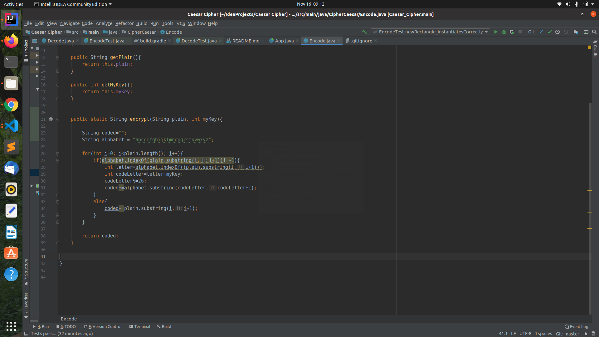
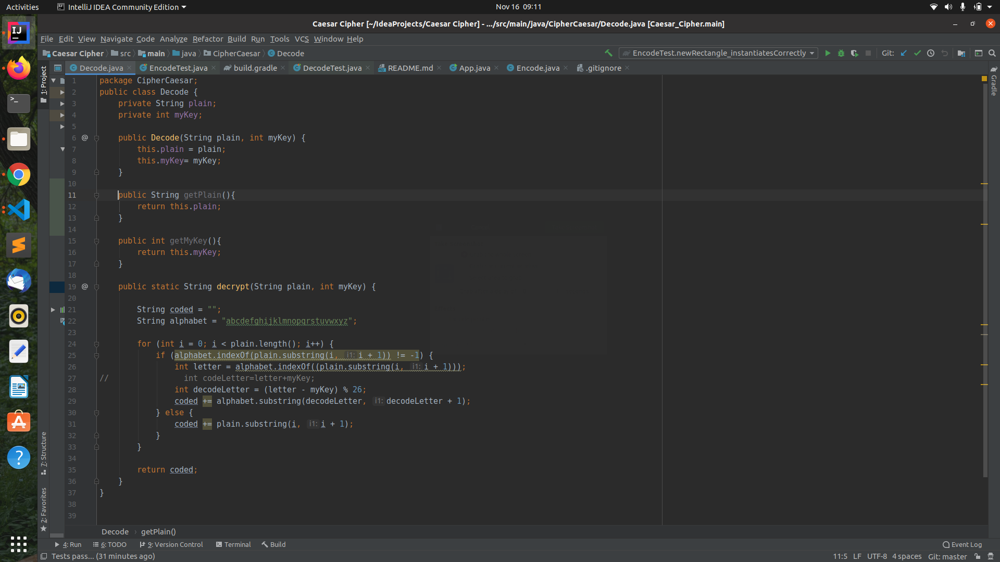
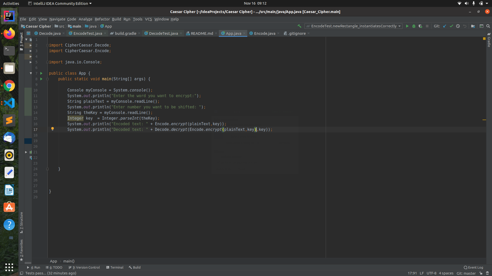
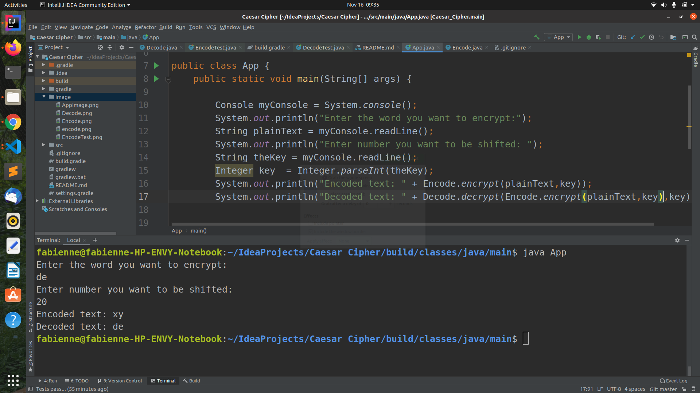

# Project Name 
Caesar Cipher

# Author name 

Fabienne Hirwa

# Description of project:

A Caesar cipher is a type of substitution in which each letter is shifted a certain number of places also known as a key, down the alphabet.  For example, with a shift of 1, A would be replaced by B, B would become C, and so on. 
# project setup instructions:

You have to open yur terminal(Ctrl+Alt+T) You have to clone this project by using this link https:https://github.com/FabienneHirwa/cipher.git
 
 
 
 
 